# Artemis
> Hinweis: dies nicht nicht die offizielle Artemis Dokumentation der TUM, sondern eine Hilfe für Studierende der Universität Stuttgart

## Wo finde ich Artemis?
Das Artemis der Universität Stuttgart findet man unter [https://artemis.k8s.sqa.ddnss.org/](https://artemis.k8s.sqa.ddnss.org/)

## Anmelden
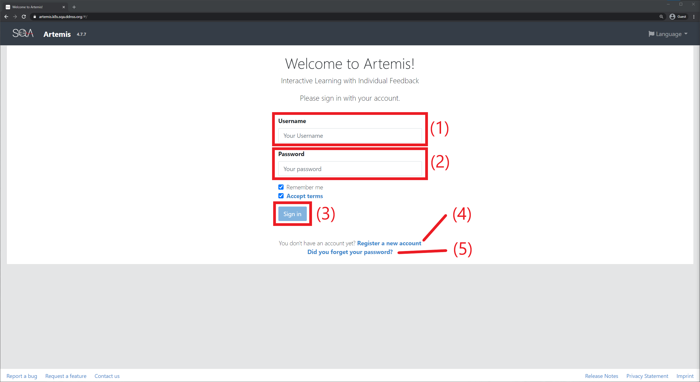
- Falls schon ein Account existiert
    1. Unter **(1)** den gewählten username eintragen (Achtung: NICHT die Email, sondern den username)
    2. Unter **(2)** das gewählte Passwort eingeben
        - Falls man das Passwort vergessen hat, kann man dies unter **(5)** zurücksetzen
    3. **(3)** zum Anmelden drücken
- Falls noch kein Account existiert
    - Unter **(4)** erstellt kann man einen neuen Account erstellen
    - Weiter siehe [Account erstellen](#Account-erstellen)

## Registrierung

### Account erstellen
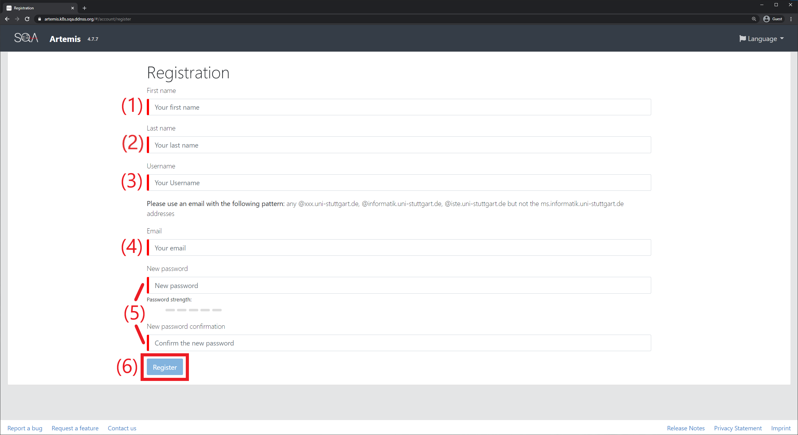
1. Bei **(1)** den Vornamen eingeben
2. Bei **(2)** den (Nach)Namen
3. Bei **(3)** einen selbst gewählten Username eingeben
    - Dieser wird in Zukunft auch bei jeder Anmeldung benötigt
4. Bei **(4)** die eigene Universitäts-Email-Adresse eingeben
    - Es können nur stxxxxxx@stud.uni-stuttgart.de Adressen
    - Es kann nur ein Account pro Adresse erstellt werden
    - Diese wird verwendet um die Registrierung zu bestätigen
5. Bei **(5)** ein sicheres Passwort wählen
    - Man benötigt dieses zum Login bei Artemis
    - Ebenso benötigt man es zum herunterladen (clonen) eines Projektes
6. Durch einen Klick auf _Register_ **(6)** wird die Registrierung abgesendet

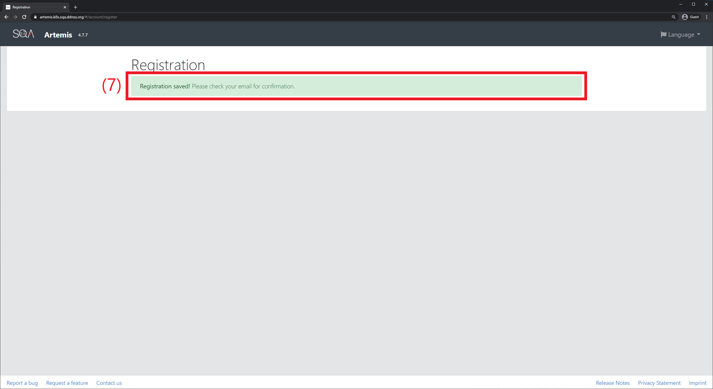

7. War die Registrierung erfolgreich, erscheint bei **(7)** eine Bestätigung

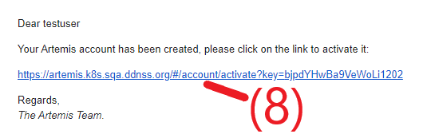

8. Unter der bei **(4)** angegebenen Email-Adresse erhält man eine Email mit einem Bestätigungslink **(8)**
    - Hinweis: bis der Link aufgerufen wird, ist das Konto nicht bestätigt, d.h. man kann sich nicht auf Artemis anmelden
9. [Sich auf Artemis anmelden](#Anmelden)
10. [Sich für den PSE Kurs anmelden](#Für-PSE-Kurs-anmelden)

### Für PSE Kurs anmelden
> Hinweis: für diese Ansicht muss man [angemeldet sein](#Anmelden)

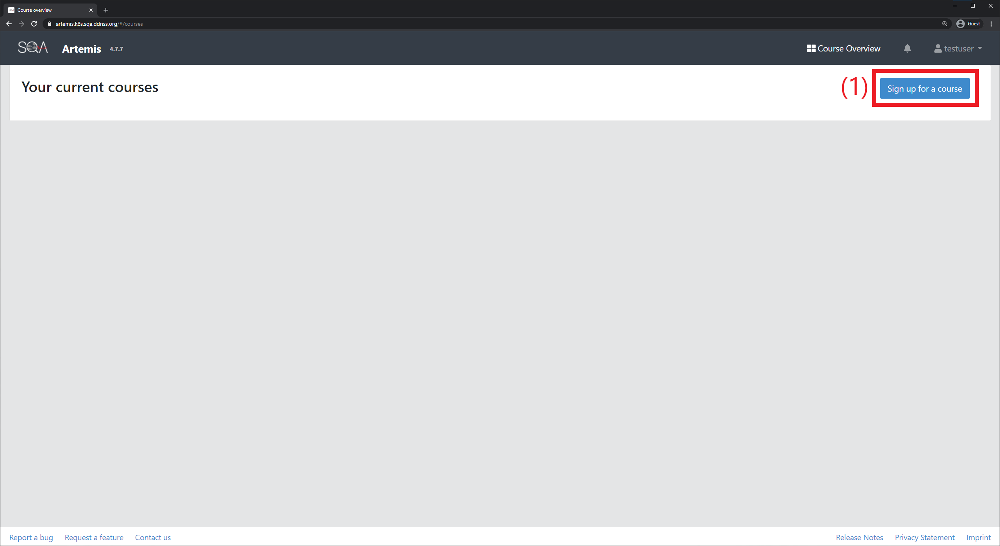
1. Auf _Sign up for course_ **(1)** klicken

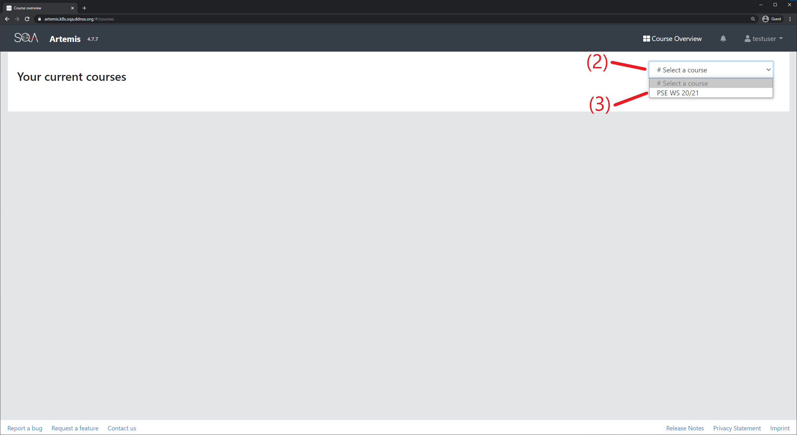
2. Unter _# Select a course_ **(2)** _PSE WS 20/21_ **(3)** auswählen

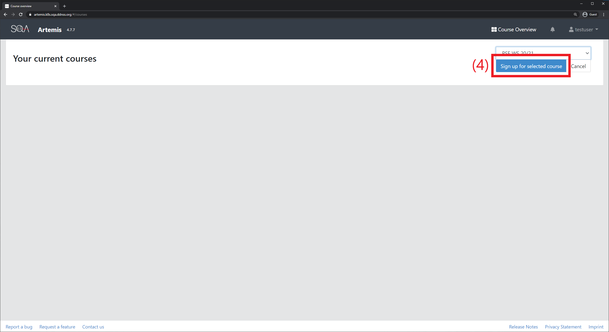
3. Mit _Sign up for selected course_ **(4)** sich für den Kurs anmelden

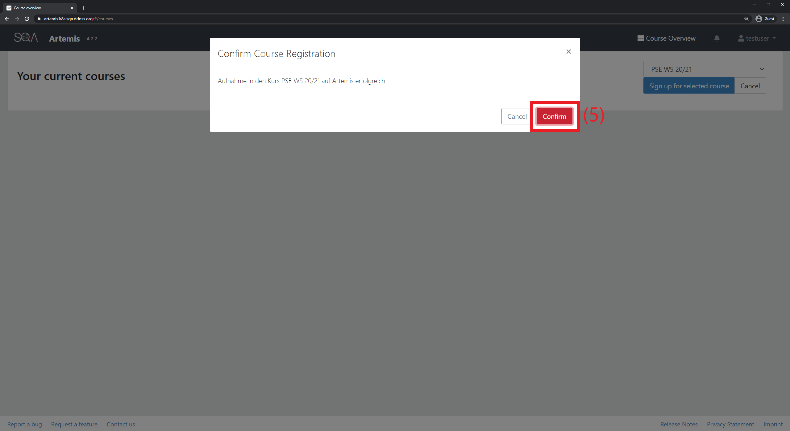
4. Die Anmeldung mit _Confirm_ **(5)** bestätigen
5. Ab jetzt wird auf der Übersichtsseite der Kurs _PSE WS 20/21_ angezeigt, vgl. [Kursübersicht](#Kursübersicht)

## Kursübersicht
> Hinweis: für diese Ansicht muss man [angemeldet sein](#Anmelden)

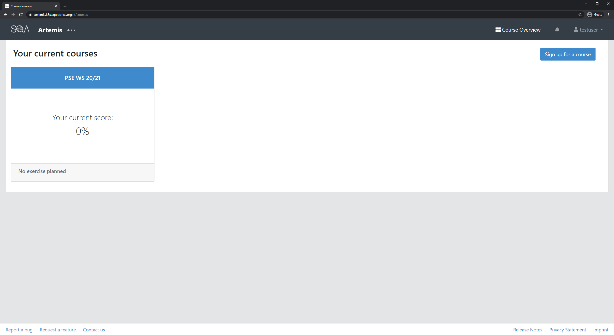
- Auf der Überblicksseite sind alle angemeldeten Kurse **(1)** sichtbar
    - Ist der Kurs _PSE WS 20/21_ nicht sichtbar, [steht die Anmeldung für diesen noch aus](#Für-PSE-Kurs-anmelden)
    - Durch einen Klick auf den Kurs erhält man einen [Überblick über die Aufgaben des Kurses](#Aufgabenübersicht)

## Aufgabenübersicht

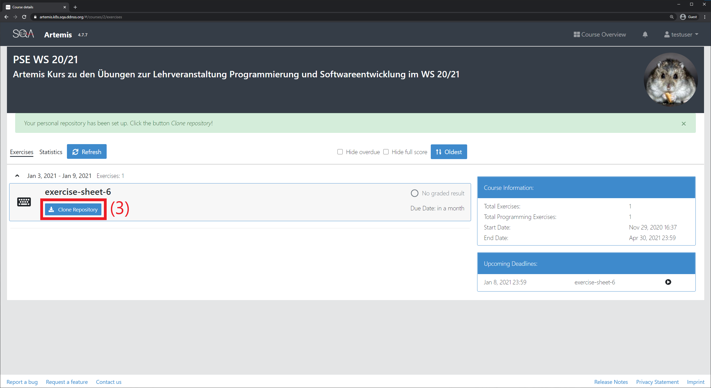
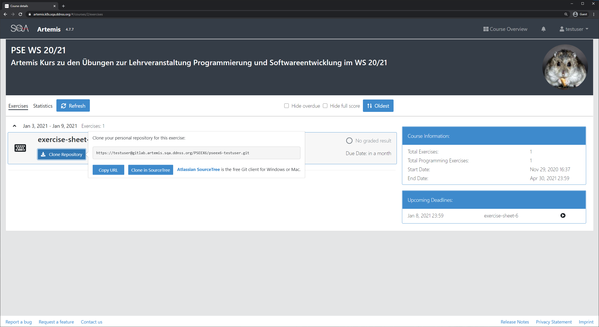
- Unter **(1)** findet sich eine chronologische Auflistung aller Aufgaben
- Noch nicht gestartete Aufgaben erkennt man  am _Start exercise_ **(2)** Button  
  - Durch einen Klick auf diesen Startet man die Aufgabe
- Schon gestartete Aufgaben erkennt man am _Clone Repository_ **(3)** Button
    - Durch einen Klick auf diesen öffnet sich ein Popup, in dem man die URL des Repositories kopieren **(4)** kann
    - Diese URL ist notwendig um das Projekt...
        - ... in Eclipse zu öffnen: siehe Video _Versionskontrolle mit git (Theorie)_ und Anleitung Übungsblatt, Anleitung hier folgt
        - ... in SQA Code online öffnen: siehe [SQA Code Online Dokumentation](https://github.com/SQAHamster/SQA-Code-Online-Documentation/blob/master/doc.md#artemis)
    - Beim Herunterladen des Projekts wird ein Passwort (und ggf. ein Username) abgefragt: hierbei handelt es sich um das Artemis-Password und Username
- Durch einen Klick auf die jeweilige Aufgabe galangt man zur [Detailansicht der Aufgabe](#Aufgabendetails)
- Jede Aufgabe hat ein Abgabedatum (/Einreichungsfrist) **(5)**
    - Achtung: Abgaben finden weiterhin in Ilias statt! Das Abgabedatum auf dem Arbeitsblatt / in Ilias ist gültig! Die Angabe in Artemis dient nur zur Orientierung und kann (u.a. aus technischen Gründen) abweichen.

## Aufgabendetails
> Hinweis: zu dieser Ansicht zu gelangen siehe [Aufgabenüberblick](#Aufgabenüberblick)

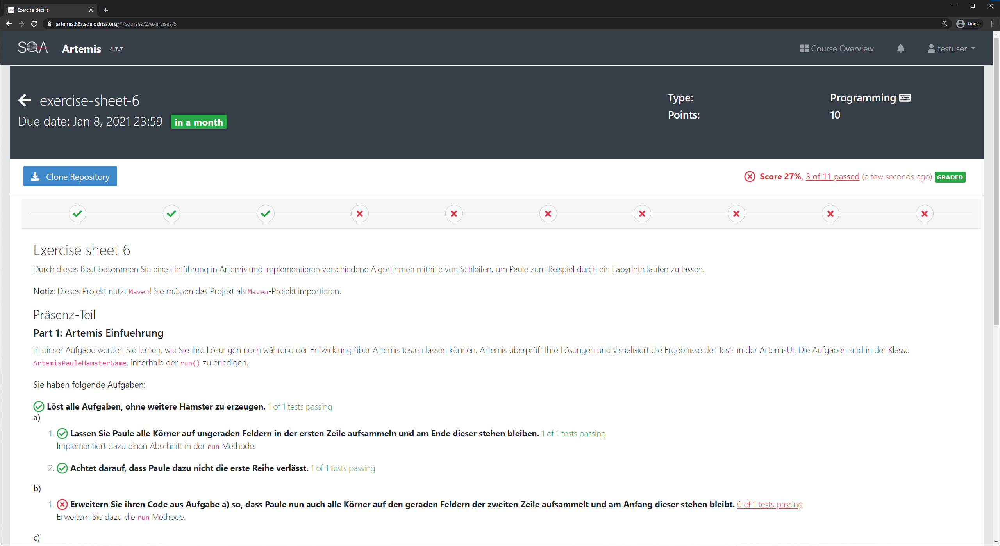
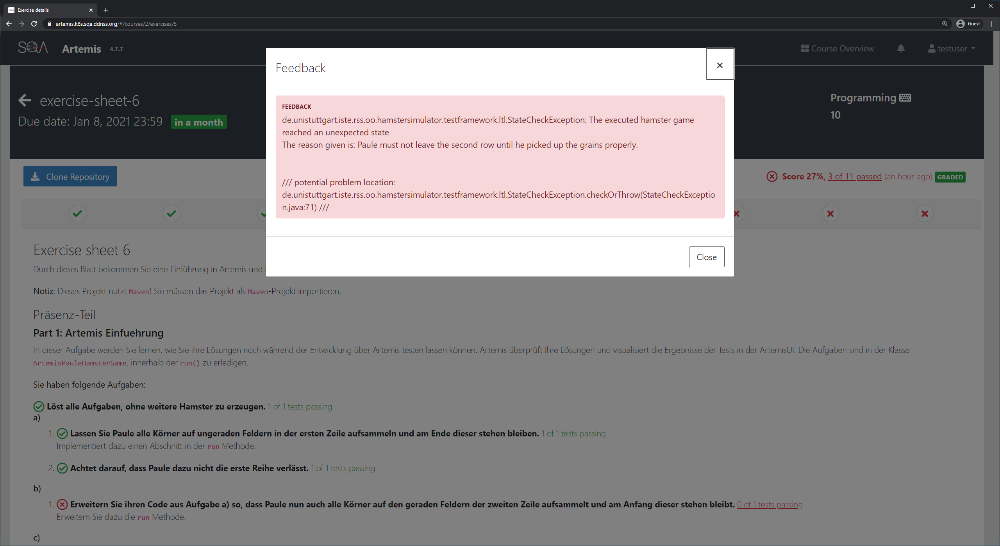
- Eine Aufgabe besteht aus mehreren Tasks **(1)**
- Sobald eine Lösung hochgeladen wurde, wird automatisch überprüft, welche Tasks erfüllt sind
    - Erfüllte Tasks werden mit einem grünen Haken **(3)** markiert
    - Nicht erfüllte Tasks werden mit einem roten Kreuz **(4)** markiert
    - Eine Teilaufgabe des Aufgabenblatts kann mehrere Tasks haben, es kann auch Tasks geben die keiner Teilaufgabe zugeordnet sind (z.B. spawne keine weiteren Hamster)
- Über der Aufgabenbeschreibung befindet sich eine Übersicht aller Tasks **(2)** sowie welcher Anteil aller Tasks erfüllt ist **(6)**
- Durch einen Klick auf **(4), (5)** und **(6)** erhält man Feedback **(7)**, warum der jeweilige Task nicht erfüllt wurde
    - Dies geschieht meistens durch eine Fehlermeldung **(8)** und/oder einer genaueren Nachricht
- Für Herunterladen (clonen) eines Projektes siehe [Aufgabenübersicht](#Aufgabenübersicht)
- Für Hochladen (pushen) eines Projektes siehe Video _Versionskontrolle mit git (Theorie)_ und Anleitung Übungsblatt, Anleitung hier folgt